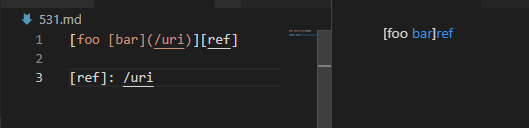
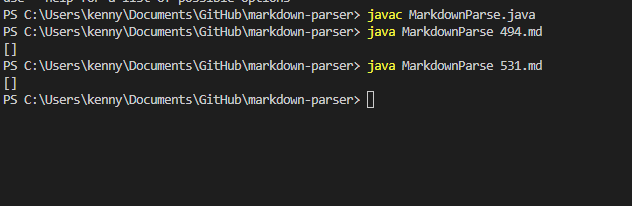
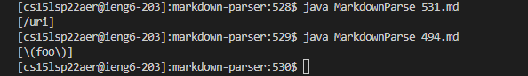

# Lab Report #5
## Finding Test Files
* When traversing throuhgout the test file folder, I tried look for those specifically with improper link formats.
* Most of the test files in nidhidhamnani's markdown parser repository were often just words and letters without brackets nor parentheses. 
* Without including the characteristics of parentheses or brackets, there is no point in testing those files are there are no links to try to return.
* Manually going through the list, I skimmed over a few files until I scrolled down to where around testfile 500 had the cases I was looking for. 
* The two test files that I have decided to use are 494.md and 531.md

---
## Test Files and their Links

* Test file [494.md](https://github.com/nidhidhamnani/markdown-parser/blob/main/test-files/494.md) and what is contained in it.

   

* Test file [531.md](https://github.com/nidhidhamnani/markdown-parser/blob/main/test-files/531.md) and what is contained in it.

   

---

## Testing 531 & 494
* So in order to test these files in my version of Markdown-Parser, I would be running it in the terminal using javac and java.

* What happens when these test cases run for 531 and 494

  

* As we can see, my markdownparse file was unable to correctly return the list of links in the files.

---

## nidhidhamnani Testing results
* So when I copied over the files to nidhidhamnani repository and run them in the terminal, this is what shows up.

 

* As we can see above, his version of Markdown-parser was able to return some value within the array when ran using the main method.

* Both files were able to return the correct list of links

## Overall summary

* I was not able to correctly return the right array with my code, while the other person's repository was able to run 1/2 test files and return the right array.

* For 531, their program was able to find out which links to pull based on which line contained parentheses. 

* As for 494, it was able to return the link in that file. Or in short, whatever was inside the parentheses. 

