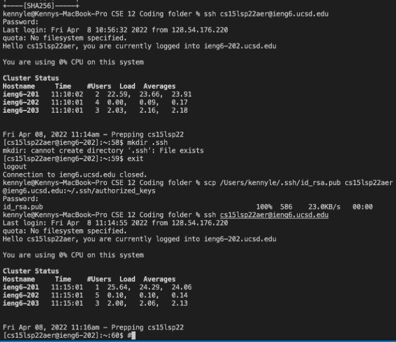

# Lab Report #1
## **Introduction**
 
So in this week's lab report, you'll be learning about remote access and how to log in without having to type your password everytime. Below are the steps to get you started.

---
 

## **Step 1**
* Download [VSCode](https://code.visualstudio.com/Download), this is what we will be using to remotely log into our accounts for this class

---
 

## **Step 2**
* Once you have VSCode installed and opened up, on the top left of your screen you will see Terminal, click on it. Then click New Terminal or use the shortcut CRTL+SHIFT+'

---

 

## **Step 3**
* Now that you have VSCode and your terminal, what you want to do now is type in **ssh cs15lsp22(UserName)@ieng6.ucsd.edu** 
* The (UserName) should be your own unique username or else it won't work.
* Then you want to enter in your own password that you created upon activating this account.
 

---

## **Step 4**
* Great now that you're logged into your remote account, here are some commands for you to try!
* pwd - typing this into the terminal while logged in will show you your current work directory.
* You can find a cheat sheet full of commands [here](https://www.cmu.edu/computing/services/comm-collab/collaboration/afs/how-to/unix-commands.pdf)

---

## **Step 5**
* Now that you got the gist of what you can type into the terminal, lets try moving files from your local computer into your remote server
* The command line is **scp (The name of the file) cs15lsp22(UserName)@ieng6.ucsd.edu**
* In the example below, I will be finding the file called WhereAmI.java in my computer

## **Step 6**
* In this step, we will be showing you how to log into your remote account without having to put in your password every time.
* First, you want to enter this command into the terminal **ssh-keygen -t rsa**
* This command creates an ssh key that is saved on your local computer, which will be used to log into your remote account
* When it askes for a paraphrase, just press ENTER twice, don't type anything in it.
* An ASCII art will appear, this means you're on the right track

## **Step 7**
* Last and final step, you now want to run the scp command by using **cs15lsp22(UserName)@ieng6.ucsd.edu~/.ssh/authorized_keys**
* Now you should be able to just log into your remote account without typing in your password everytime.

