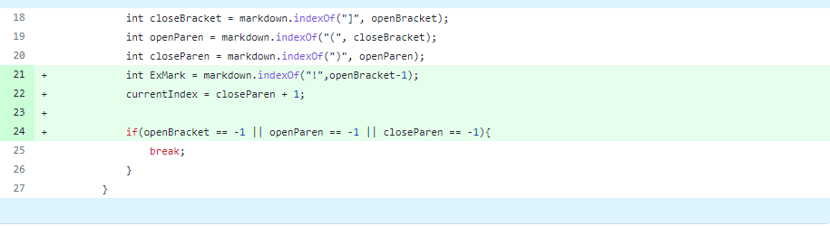
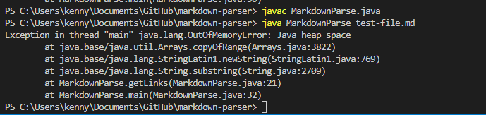
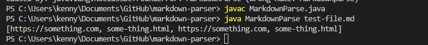
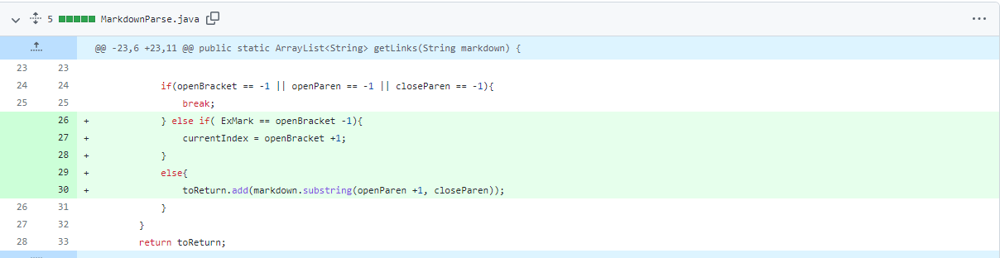
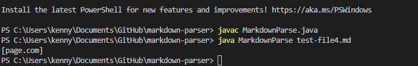
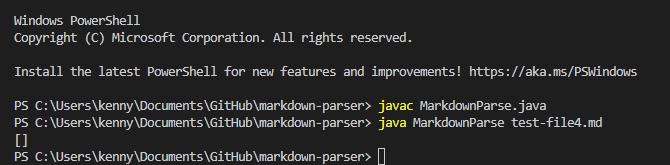
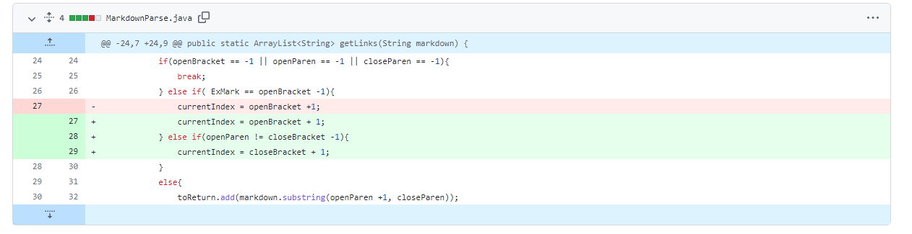
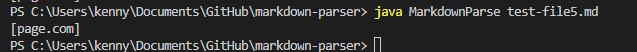
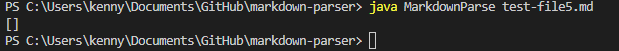

# Lab Report #2

## Error #1
* For the first error, when running the code it would continue in an infinite while loop until we run out of memory to run the program.
* Below is the code change that was made to fix this infinite while loop error. This if statement would check if the current index is blank and not the first line in order to break out of the while loop after checking all lines for websites.
* Link to input file used to prompt for correction of error. [Link to test file](https://github.com/redagent750/markdown-parser/blob/main/test-file.md)
 

* Below are the errors that were shown before fixing the code.
 

* Below is the terminal after fixing the issue of the infinite loop.
 

* The symptom is the while loop within the program kept running until it ran out of space. The bug would be how this while loop is coded to keep running forever since nothing breaks it out. This causes the while loop to forever run until it runs out of memory, which is the only reason why it stops. 

---
## Error #2
* For the second error, when a test file is read for websites only, it also return images as if it was reading websites.
* Below is the code change made in order to have images not be read as websites since both formats are similar in nature.
* Link to the input test file that was reffered off of to fix the problem. [Link to test file](https://github.com/redagent750/markdown-parser/blob/main/test-file4.md)
 

* Below is the error before the code was fixed, keep in mind that it runs but doesn't give the right output.
 

* Below is the terminal after fixing the issue of returning the correct output for images.
 

* The symptom is that images and sites are read the same since they both have similar formats, the only difference is that images have an ! in front of their format. The bug in this case would be how the code doesn't account for what to differentiate as a site and an image. This would cause the program to mistaken an image as a site and return it's source code as if it was a site, which it shouldn't be doing.

---

## Error #3
* For the third error that was encountered, it would return the site even if the brackets and parantheses aren't on the same line. It shouldn't be able to return such site as they're not formatted correctly together.
* Below is the code change made in order to only return correctly formatted sites in the test file. 
* Link to the input test file that was used for this error. 
[Link to test file](https://github.com/redagent750/markdown-parser/blob/main/test-file5.md)
 

* Below is the error before the code was fixed, it returns the characters within the parentheses in the test file. It is not suppose to return it as it was not correctly formatted in the file.
 

* Below is the terminal after fixing the issue of returning the correct output for images.
 

* The symptom was that when the code was trying to find open brackets and closed brackets within the code, it doesn't take into account where those characters are placed so it just returns whatever is in parentheses when it shouldn't be the case. It should only return the site if the closing bracket are followed by an opening parenthese. The bug in this case would be how the code was not able to differentiate which site is correctly formatted to be returned. 