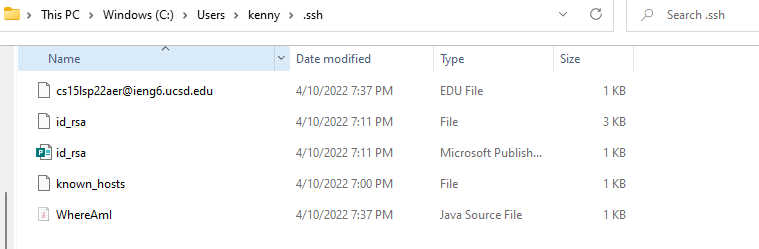

# Lab Report #3

## Streamlining ssh Configuration

* First step, to set up streamlining ssh, you want to locate your ssh files within your system.
* For windows, you would open files > This PC > Windows (C:) > Users > (Your computer username) > ssh

* After you found your ssh files, open the config file you see within the window. For me I don't have one, so I will be creating a new file called config.
* Make sure that this config file is a text document, open this document with Notepad.
* After you open it, type in this format
 Host (host)
 HostName (HostName)
 User (your username)
* In other words, it should look something like this with ieng6.

---

## Setup Github Access from Ieng6

---

## Copy whole directories with scp -r