# Lab Report #3

## Streamlining ssh Configuration

* First step, to set up streamlining ssh, you want to locate your ssh files within your system.
* So open up the terminal, and type in these commands
  cd ~
  cd .ssh/
  touch config
* This creates the config file on your local machine.
* Now type these commands.
 **ls** 
  **pwd**
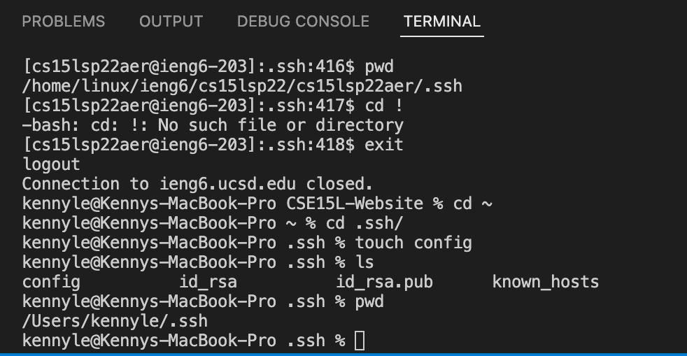

* After your directory for ssh is open, click on it to open up the folder. Within this folder you shall see a file called config. Now what you want to do is edit that file based on this format below. 
 **Host (host)**
 **HostName (HostName)**
 **User (your username)**
* In other words, it should look something like this with ieng6.
 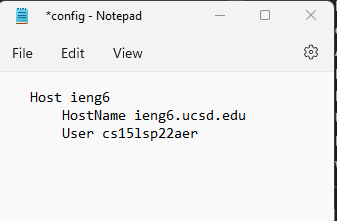

* After you have edit the config file using Notepad for windows or in VSCode for Linux, save it and open your terminal.
* Now all you have to do njow to log into your remote machine is just type in **ssh ieng6**, **ieng6** being your host.
* Now you can remotely log in faster by just tying in the host name instead of the entire username of yours!
* Below is what it looks like by just logging in with thos shortcut.

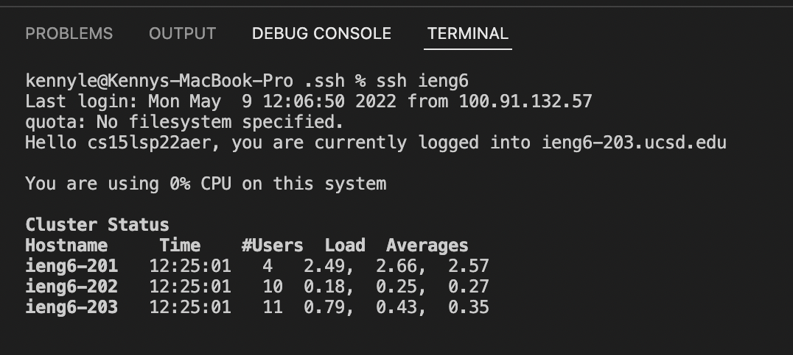

---

## Setup Github Access from Ieng6
* In order to set up git access on your remote machine, first you want to login to your ssh account.
* To do that type in ssh ieng6(assuming that you already set up streamlining)
* Then you want to use this command below on your remote machine
  **ssh-keygen**
* After you created that key, inside your remote machine open up the ssh directory.
* Then what you want to do now is view the contents within that key file. Copy it. Here is what it suppose to look like when you view the file.
* Use the command to view the file so you can copy it.
 **cat id_rsa.pub**

 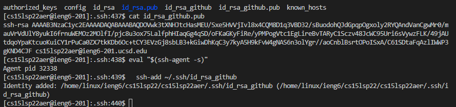
* Then go onto github, then settings, and then ssh. Add whatever the contents of the file on the key file you just created onto github.

 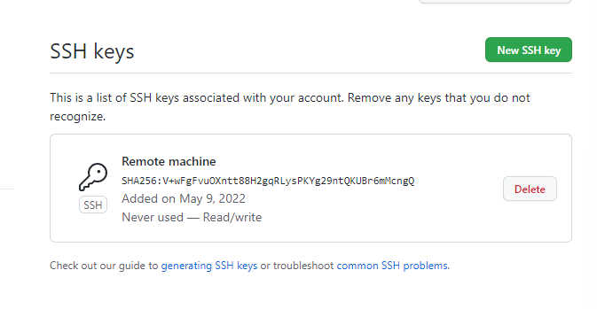
* After you add this ssh key into github run these two commands below.
 **eval "$(ssh-agent -s)"**
 **ssh-add ~/.ssh/id_rsa**
* Now that is all, you should be able to use git commands using this ssh key.
* To add any files of your choice, just run this command.
 **git add (FileName)**
* To commit to github, you would use **git commit -m (SummaryCommit)**. The summaryCommit is just comments of what you updated when you commit the new edits to github. Can be literally anything.

 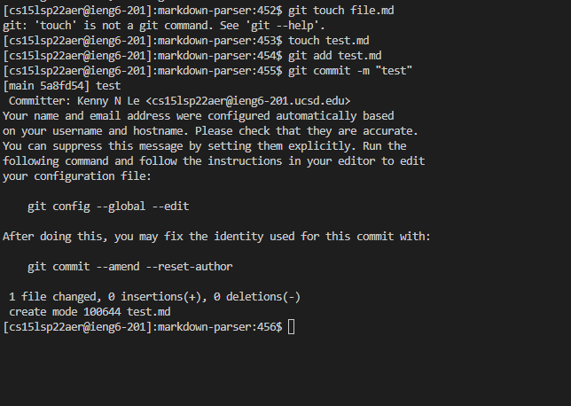

* Before you would commit it into github remotely, run these lines below to ensure that it is being commited to the correct directory.
 git remote add origin (Your ssh github directory link)
 git remote set-url origin (Your ssh github directory link)

* To push to github, you want to use **git push**, this would then update the commit you created on your local machine into the origin on github.
* Below are images of me running the command that would let me copy repositories into my machine.
 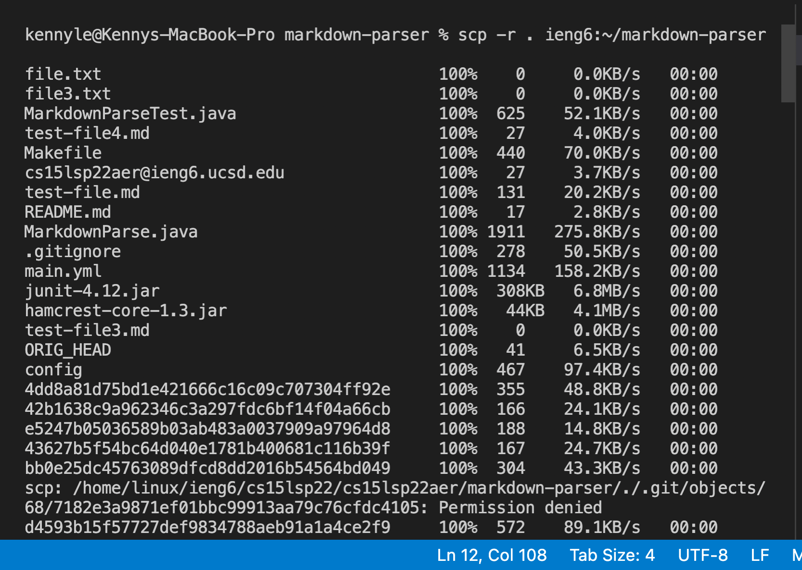
 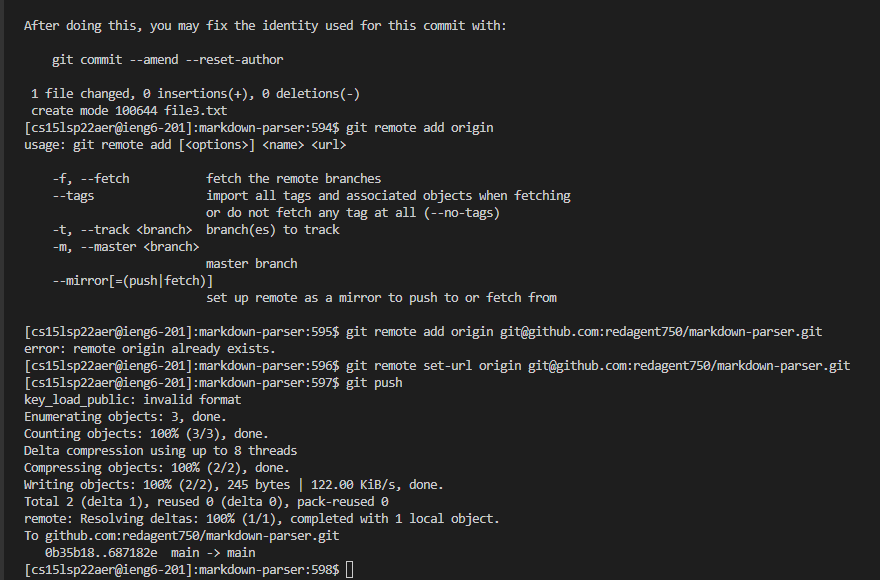

---

## Copy whole directories with scp -r
* scp -r is a command that lets you copy files from your local machine into your remote machine.
* So in order for you to copy files you want use this command outline on your local machine.
  **scp -r . cs15lsp22(user)@ieng6.ucsd.edu:~/(Whatever files you want to copy over)**
* Once this is done you should get something similar ran in your terminal like this.
 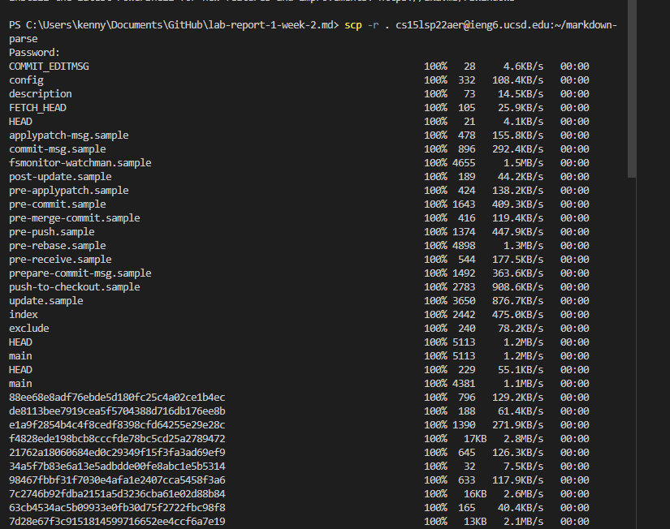
* Now you should be able to see these files within your remote machine when you use **ls**
 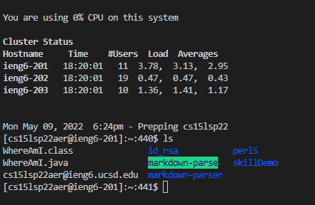

* Now open up your directory that you want to test, make sure there are test files to test your method.
* First, run file that is going to be ran by typing **javac (nameOfFile.java)**
* Then, you want to run **java (nameOfFile) (NameOfTestFile.md)**
* It will then compile the method you want to run and use another file to test it out to return results.
 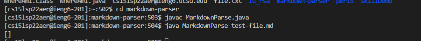