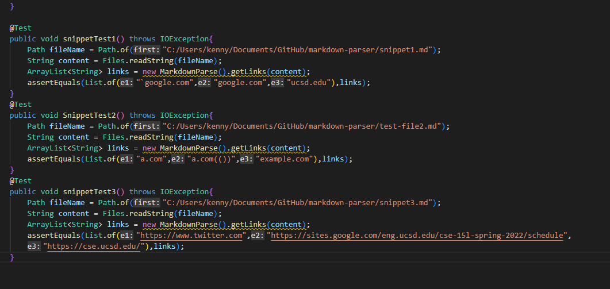
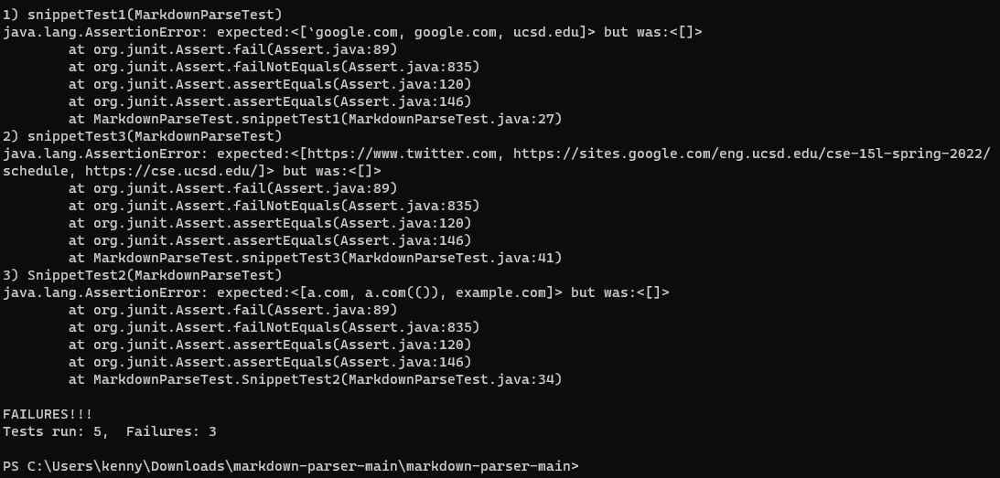

# Lab Report #4

## Markdown Snippets
---
* Below are the Snippets shown as test files in CSCode for Markdown-Parser

* Snippet #1

* Snippet #2

* Snippet #3

---
## Implemented Test Case for Snippets
---

* Below is the code for the test case made for the snippets

* Below is the outcome when the test cases are ran in my terminal

* [Link to MarkdownParser Repo](https://github.com/redagent750/markdown-parser)

---
## Questions for Snippets
---

* Question #1: **Snippet 1**

* Question #1: **Snippet 2**

* Question #1: **Snippet 3**

