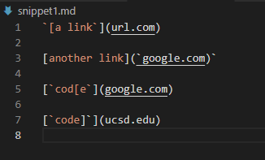
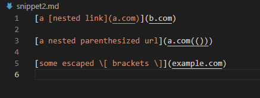
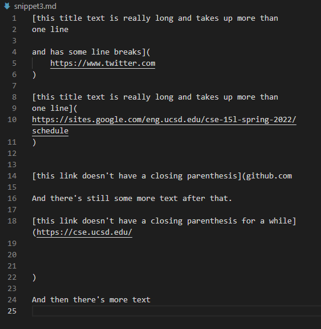

# Lab Report #4

## Markdown Snippets
---
* Below are the Snippets shown as test files in CSCode for Markdown-Parser

* Snippet #1

* Snippet #2

* Snippet #3

---
## Implemented Test Case for Snippets
---

* Below is the code for the test case made for the snippets

* Below is the outcome when the test cases are ran in my terminal

* [Link to MarkdownParser Repo](https://github.com/redagent750/markdown-parser)

---
## My 3 other Implemented Test Case for Snippets
---

* 

---
## Questions for Snippets
---

* Question #1: **Snippet 1**
 There could be more involvement in how I can change my code to read snippet #1 and pass the test case. I can see that my code has a problem with reading test files containing backticks. I think that I can fix this by implimenting a statement that would check for those backticks throughout the entire file. If they're within the parentheses, then it's not required to do anything as they're apart of the file link. However, if they're outside in the beginning and surrounding the entire link structure or part of it inside. Then I would have to check for that error and skip the line if it doesn't meet a proper link structure. There are also other errors in the file, so this would take more then 10 lines of code to fix.

* Question #1: **Snippet 2**
 There could be more involvement in how I can change my code for snippet #2, as this test file has errors concerning more/less brackets and parentheses in in the link structure. How I can impliment it's fix is by keeping track of where the first open bracket occurs and ignoring the other open brackets until it finds a closed bracket with a parentheses after it. It would then keep going after that parentheses to check for the last closing bracket after that. As for the parentheses, I can then check for the first occuring parentheses if it meets the previous requirement, and then ignore any other open parentheses until it meets a closing parentheses. The closing parentheses would be found if the current closed parentheses has another closed parentheses after it. 

* Question #1: **Snippet 3**
 There could be more involvement in how snippet 3 can be used to influence my code change for my markdown-parse. I can add code that will check for missing brackets/parentheses, which will not return the site if a closing parenthese/bracket is not followed after the next line. It would also check for trailing link structures, not returning the link if it is broken up to more then 1 line. 

